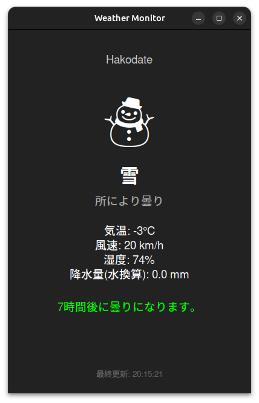

# Weather Monitor CLI

ターミナル上で動作する、シンプルで視覚的な天気情報モニターです。
ASCIIアートを使用して天気を表示し、指定した更新間隔で[wttr.in](https://wttr.in)から最新の天気情報を取得・更新します。
**Version 3.0.0 より Python 製になりました。**

## 機能

- **ASCIIアート表示**: 晴れ、曇り、雨、雪などの天気を視覚的なアスキーアートで表示します。
- **詳細情報**: 気温、湿度、風速、気圧、降水量などの詳細な気象データを表示します。
- **警報・注意報**: 激しい雨や強風、荒天（雷雨、吹雪など）を検知すると、赤字で警告メッセージを表示します。
- **予報モード**: 8時間先までの予報を解析し、天気の変化（いつ雨が降り始めるか、いつ止むかなど）を通知します。
- **自動更新**: ユーザーが指定した間隔（秒）で情報を定期的に更新します。
- **GUIモード**: Tkinterを使用したグラフィカルなウィンドウ表示も可能です。予報情報や「常に最前面」表示に対応しています。
- **多言語対応**: システムの言語設定 (`LANG`) に応じて、日本語と英語の表示を自動的に切り替えます。

## 動作環境

- `python3` (3.6以上推奨)
- 標準ライブラリのみ使用 (`urllib`, `json`, `argparse` 等)

※ 以前のバージョンで必要だった `curl`, `jq`, `bc` は不要です。

## 使用方法

スクリプトに実行権限を与えてから実行してください。

### 1. 実行権限の付与

```bash
chmod +x weather_monitor.py
```

### 2. プログラムの実行

更新間隔（秒）を `--interval` オプションで指定して実行します。

```bash
# 例: 60秒ごとに更新
./weather_monitor.py --interval 60

# 短縮形 (-i) も使用可能
./weather_monitor.py -i 300

# python3 コマンド経由でも実行可能
python3 weather_monitor.py -i 60
```

終了するには `Ctrl+C` を押してください。

### オプション一覧

| オプション | 説明 |
| :--- | :--- |
| `-i, --interval SECONDS` | **[必須]** 天気情報の更新間隔を秒単位で指定します（`-o, -f, -g` 指定時は不要）。 |
| `-o, --once` | 一度だけ表示して終了します。 |
| `-f, --forecast` | 8時間先までの予報を確認し、一度だけ表示して終了します。 |
| `-g, --gui` | GUIモードで起動します（10分間隔で自動更新）。 |
| `-y, --background` | GUIモードをバックグラウンドで起動します（`-g` 指定時のみ有効）。 |
| `-h, --help` | ヘルプメッセージを表示して終了します。 |
| `-v, --version` | バージョン情報を表示して終了します。 |

## スクリーンショット

### CLIモード

実行すると、以下のような情報が表示されます（イメージ）。

```text
       \   /
        .-.       [ 晴れ ]
     -- (   ) --
        `-’
       /   \

========================================
 現在の天気: 晴れ
 詳細: 快晴
----------------------------------------
 地点: Tokyo
 気温: 25℃
 湿度: 40%
 風速: 15 km/h
 ```

### GUIモード

`-g` オプションで起動すると、グラフィカルなウィンドウで情報を表示します。右クリックメニューから「常に最前面に表示」の切り替えが可能です。



## ライセンス

LICENSEファイルを参照してください。

---

## Weather Monitor CLI (English)

A simple, visual weather information monitor for the terminal.
It uses ASCII art to display weather conditions and fetches updates from [wttr.in](https://wttr.in) at specified intervals.
**Rewritten in Python as of Version 3.0.0.**

## Features

- **ASCII Art Display**: Visual representation of weather (Sunny, Cloudy, Rain, Snow, etc.).
- **Detailed Information**: Displays temperature, humidity, wind speed, pressure, precipitation, and more.
- **Warnings/Alerts**: Displays warnings in red for heavy rain, strong winds, or severe weather (storms, blizzards).
- **Forecast Mode**: Analyzes forecast for the next 8 hours and notifies of weather changes (e.g., when rain starts/stops).
- **Auto Update**: Regularly updates information at user-defined intervals (in seconds).
- **GUI Mode**: Graphical window display using Tkinter. Supports forecast info and "Always on Top" mode.
- **Multi-language Support**: Automatically switches between Japanese and English based on your system language (`LANG`).

## Requirements

- `python3` (3.6+ recommended)
- Uses standard libraries only.

## Usage

Make sure to give execution permission to the script.

### 1. Grant Permission

```bash
chmod +x weather_monitor.py
```

### 2. Run Program

Specify the update interval (in seconds) using `--interval`.

```bash
# Example: Update every 60 seconds
./weather_monitor.py --interval 60

# Short form (-i)
./weather_monitor.py -i 300
```

To exit, press `Ctrl+C`.

### Options

| Option | Description |
| :--- | :--- |
| `-i, --interval SECONDS` | **[Required]** Update interval in seconds (not required with `-o, -f, -g`). |
| `-o, --once` | Display once and exit. |
| `-f, --forecast` | Check forecast for next 8 hours and exit. |
| `-g, --gui` | Launch in GUI mode (updates every 10 minutes). |
| `-y, --background` | Launch GUI in background (only with `-g`). |
| `-h, --help` | Display help message. |
| `-v, --version` | Display version information. |

## Screenshots

### CLI Mode

```text
       \   /
        .-.       [ SUNNY ]
     -- (   ) --
        `-’
       /   \

========================================
 Current Weather: Sunny
 Detail: Clear
----------------------------------------
 Location: Tokyo
 Temp: 25C
 Humidity: 40%
 Wind: 15 km/h
 ...
```

### GUI Mode

When launched with the `-g` option, a graphical window is displayed. You can toggle "Always on Top" from the right-click menu.


## License

See the LICENSE file.
